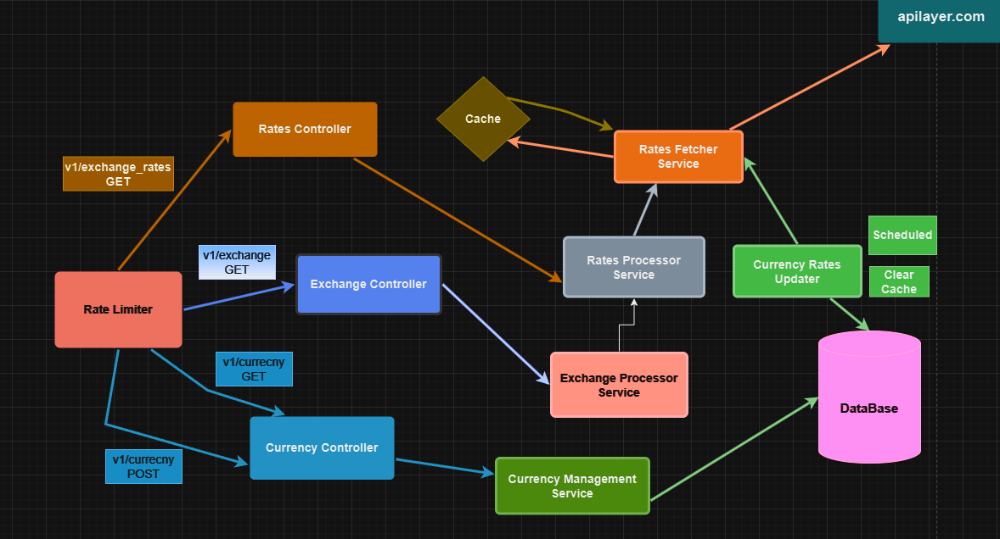

# Currency Exchange Service

This project is a Spring Boot application that provides a REST API for managing currencies and retrieving their exchange rates. It integrates with an external exchange rate provider API and uses a PostgreSQL database for persistent storage. Docker Compose is used to set up the database.

---

## Features

- **Get a list of tracked currencies**: Retrieve all currencies currently being tracked by the application.
- **Add a new currency**: Add a currency to the system for tracking exchange rates.
- **Get exchange rates**: Retrieve exchange rates for a specific currency.
- **Convert amount**: Convert amount regarding exchange rates
- **Scheduled updates**: Automatically fetch and update exchange rates for all tracked currencies every hour.
- **Caching**: Uses Spring Cache to reduce redundant API calls.
- **Rate limiting**: Limits the frequency of requests to the external API using Resilience4j.

---
## Flow diagram 

---

## API Documentation
- Open [Swagger UI](http://localhost:8080/swagger-ui.html) in your browser for API  if you run without a docker.
- Open [Swagger UI](http://localhost:8090/swagger-ui.html) in your browser if with

---

## **Explore REST APIs**

#### You can get a postman collection in a `collection` folder

| Method | URL                                      | Description                     |
|--------|------------------------------------------|---------------------------------|
| GET    | `/api/v1/exchange_rates`                | Get exchange rates             |
| GET    | `/api/v1/exchange`                      | Convert amount using rates     |
| GET    | `/api/v1/currency`                      | Get tracked currencies         |
| POST   | `/api/v1/currency`                      | Track new currencies           |

### API Details

#### Get exchange rates
- **URL**: `http://localhost:8090/api/v1/exchange_rates?source=USD&targets=EUR,GBP,UAH`
- **Method**: GET
- **Query Parameters**:
  - `source`: Currency to convert from (e.g., `USD`)
  - `targets`: Comma-separated list of target currencies (e.g., `EUR,GBP,UAH`)

#### Convert amount using rates
- **URL**: `http://localhost:8090/api/v1/exchange?source=USD&targets=EUR,UAH&amount=10`
- **Method**: GET
- **Query Parameters**:
  - `source`: Currency to convert from (e.g., `USD`)
  - `targets`: Comma-separated list of target currencies (e.g., `EUR,UAH`)
  - `amount`: Amount to convert (e.g., `10`)

#### Get tracked currencies
- **URL**: `http://localhost:8090/api/v1/currency`
- **Method**: GET

#### Track new currencies
- **URL**: `http://localhost:8090/api/v1/currency`
- **Method**: POST
- **Body**:
```json
{
    "currencies": ["USD", "EUR"]
}
```

## Prerequisites

---
- Get API KEY from apilayer.com
- Maven or Docker
---

## Notes

- Currently, the database is stored locally and saved in the `db` folder at the root of the project.
- To ensure the database is recreated, remove the `volume` section from the `docker-compose` file.
---
### Create .env and Define API key

    exchange-api.api-key={YOUR_API_KEY}
---

### Docker Run
The application can be built and run by the `Docker` engine. The `Dockerfile` has multistage build, so you do not need to build and run separately.

Please follow directions shown below in order to build and run the application with Docker Compose file;

```sh
$ cd currency-exchange-service
$ docker-compose up -d --build
```
---

## Technologies

- **Java 17**
- **Spring Boot 3.3.6**
- **Spring Cache**
- **Spring Data JPA**
- **PostgreSQL**
- **H2 database**
- **Liquibase**
- **Open API Documentation**
- **Actuator**
- **Resilience4j**
- **Lombok**
- **Maven**
- **Junit5**
- **Spring Test**
- **Docker**

---


